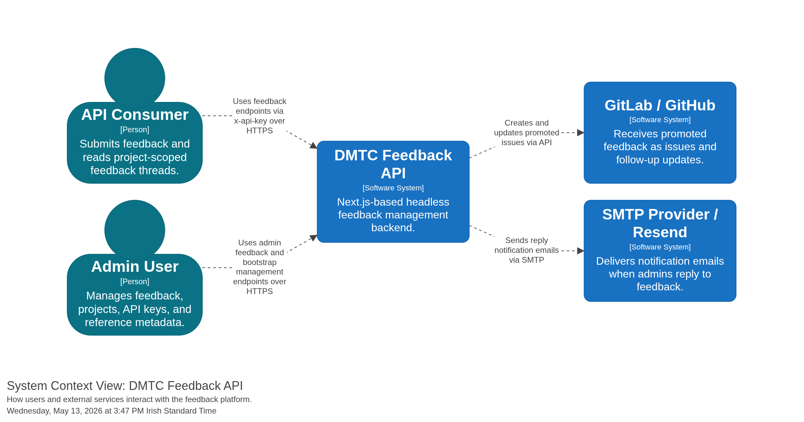

# DMTC  Headless Feedback

Headless feedback management backend built with Next.js route handlers and SQLite.

## Overview

- Versioned REST API under `/api/v1/*`
- Project-scoped API keys via `x-api-key`
- Bootstrap-token protected admin key and project management
- Feedback thread support with initial and follow-up messages
- Promotion sync to GitLab issues and/or GitHub issues
- OpenAPI JSON and Swagger UI docs
- SQLite-backed storage with hashed API keys

## Architecture


Additional generated diagrams are available in [`diagrams/`](./diagrams), including the system context and Docker deployment views.

## Route Map

### Platform

- `GET /api/healthcheck`
- `GET /api/v1/openapi.json`
- `GET /api/v1/docs`

### Bootstrap-Protected Admin Setup

- `GET /api/v1/admin/keys`
- `POST /api/v1/admin/keys`
- `DELETE /api/v1/admin/keys/:id`
- `POST /api/v1/admin/keys/:id/rotate`
- `GET /api/v1/admin/projects`
- `POST /api/v1/admin/projects`
- `GET /api/v1/admin/meta/:resource`
- `POST /api/v1/admin/meta/:resource`
- `GET /api/v1/admin/meta/:resource/:id`
- `PATCH /api/v1/admin/meta/:resource/:id`
- `DELETE /api/v1/admin/meta/:resource/:id`

These routes require `x-bootstrap-token`.

### Project API Key Routes

- `POST /api/v1/feedback`
- `GET /api/v1/feedback/:id`
- `POST /api/v1/feedback/:id`
- `GET /api/v1/feedback/meta`

These routes require `x-api-key`. Access is scoped to the project attached to the key.

### Admin API Key Routes

- `GET /api/v1/admin/feedback`
- `GET /api/v1/admin/feedback/:id`
- `PATCH /api/v1/admin/feedback/:id`
- `GET /api/v1/admin/feedback/:id/messages`
- `POST /api/v1/admin/feedback/:id/messages`

These routes require an API key created with `isAdmin: true`.

## Auth Model

- `x-bootstrap-token` is only for bootstrap and platform management routes under `/api/v1/admin/keys*`, `/api/v1/admin/projects*`, and `/api/v1/admin/meta*`.
- `x-api-key` is required for feedback and admin-feedback routes.
- API keys are tied to a single project.
- Admin API keys can use both project routes and admin routes for their project.
- Non-admin API keys cannot call `/api/v1/admin/feedback*`.

## Thread Model

Feedback creation and thread replies are separate operations.

- `POST /api/v1/feedback` creates the feedback row.
- If `initial_message` is supplied during creation, it is inserted as the first thread message with author role `User`.
- `POST /api/v1/feedback/:id` adds a later user follow-up message to the same thread.
- `POST /api/v1/admin/feedback/:id/messages` adds an admin reply.
- Closed feedback cannot accept new replies.
- Replies on promoted feedback are synced to every configured issue platform.

## Promotion Sync

Promoted feedback can be mirrored to external issue trackers.

- GitLab sync is enabled when both `GITLAB_REPORTING_PROJECT_ID` and `GITLAB_ISSUES_REPORTING_TOKEN` are set.
- GitHub sync is enabled when `GITHUB_REPORTING_OWNER`, `GITHUB_REPORTING_REPO`, and `GITHUB_ISSUES_REPORTING_TOKEN` are set.
- If both GitLab and GitHub are configured, promoted feedback syncs to both.
- Promotion creates one issue per feedback item, uses the first thread message as the initial issue body, and syncs later replies as notes/comments.
- Closing or reopening promoted feedback updates the linked issue state.
- Admin promote/close/draft/status actions wait for external sync and return an error if a configured platform fails.

## Environment

Create `.env.local` with at least:

```env
NODE_ENV=development
NEXT_PUBLIC_APP_URL=http://localhost:4001
NEXT_PUBLIC_FEEDBACK_API_URL=http://localhost:4001
NEXTAUTH_URL=http://localhost:4001
NEXTAUTH_SECRET=<openssl rand -base64 32>
FEEDBACK_BOOTSTRAP_TOKEN=<openssl rand -hex 24>
MAIL_PROVIDER=disabled
SQLITE_PATH=./data/feedback.db
```

Optional issue-sync configuration:

```env
GITLAB_REPORTING_PROJECT_ID=group/project
GITLAB_ISSUES_REPORTING_TOKEN=glpat-...

GITHUB_REPORTING_OWNER=your-org
GITHUB_REPORTING_REPO=your-repo
GITHUB_ISSUES_REPORTING_TOKEN=github_pat_...
```

## Local Development

```bash
npm install
npm run migrate:sqlite-seed
npm run dev
```

Run checks locally:

```bash
npm test -- --runInBand
npm run lint
```

If you hit stale `.next` issues:

```bash
pkill -f "next dev" || true
npm run clean
npm run dev
```

## Docker Releases

Pushing a Git tag that starts with `v`, such as `v0.4.0`, triggers GitHub Actions to publish a Docker image to GitHub Container Registry.
The published image is multi-architecture and supports both `linux/amd64` and `linux/arm64`, which covers typical Linux servers and Apple Silicon Macs.

Pull the latest published image:

```bash
docker pull ghcr.io/digital-metabolic-twin-centre/feedback:latest
```

Generate runtime secrets and run it directly with Docker:

```bash
export NEXTAUTH_SECRET="$(openssl rand -base64 32)"
export FEEDBACK_BOOTSTRAP_TOKEN="$(openssl rand -hex 24)"

docker run --rm -p 4001:4001 \
  -e NEXTAUTH_SECRET="$NEXTAUTH_SECRET" \
  -e NEXTAUTH_URL="http://localhost:4001" \
  -e NEXT_PUBLIC_APP_URL="http://localhost:4001" \
  -e NEXT_PUBLIC_FEEDBACK_API_URL="http://localhost:4001" \
  -e FEEDBACK_BOOTSTRAP_TOKEN="$FEEDBACK_BOOTSTRAP_TOKEN" \
  -e SQLITE_PATH="./data/feedback.db" \
  -e MAIL_PROVIDER="disabled" \
  ghcr.io/digital-metabolic-twin-centre/feedback:latest
```

The bootstrap token is not generated by the container itself. Generate it before startup and keep it, because you will need the same value for bootstrap admin calls such as project creation and API key generation.

If you want a pinned release instead of `latest`, use a version tag such as:

```bash
docker pull ghcr.io/digital-metabolic-twin-centre/feedback:latest
```

## Bootstrap Setup

Bootstrap setup does not require an existing `x-api-key`. For first-time setup, use only `x-bootstrap-token` to create the first project and/or admin API key.

Create an admin API key:

```bash
curl -X POST http://localhost:4001/api/v1/admin/keys \
  -H "Content-Type: application/json" \
  -H "x-bootstrap-token: $FEEDBACK_BOOTSTRAP_TOKEN" \
  -d '{"projectSlug":"default","projectName":"Default Project","keyName":"admin","isAdmin":true}'
```

Key creation fields:

- `projectSlug` optional
- `projectName` optional
- `keyName` optional
- `isAdmin` optional, defaults to `false`

If `projectSlug` is omitted, the API uses the first active project. If no active project exists, the default project is used/created.

Use the returned key as:

```http
x-api-key: fbk_...
```

List keys:

```bash
curl "http://localhost:4001/api/v1/admin/keys?includeRevoked=false" \
  -H "x-bootstrap-token: $FEEDBACK_BOOTSTRAP_TOKEN"
```

Rotate a key:

```bash
curl -X POST http://localhost:4001/api/v1/admin/keys/1/rotate \
  -H "x-bootstrap-token: $FEEDBACK_BOOTSTRAP_TOKEN"
```

Revoke a key:

```bash
curl -X DELETE http://localhost:4001/api/v1/admin/keys/1 \
  -H "x-bootstrap-token: $FEEDBACK_BOOTSTRAP_TOKEN"
```

Create a project:

```bash
curl -X POST http://localhost:4001/api/v1/admin/projects \
  -H "Content-Type: application/json" \
  -H "x-bootstrap-token: $FEEDBACK_BOOTSTRAP_TOKEN" \
  -d '{"slug":"project-alpha","name":"Project Alpha"}'
```

List projects:

```bash
curl "http://localhost:4001/api/v1/admin/projects" \
  -H "x-bootstrap-token: $FEEDBACK_BOOTSTRAP_TOKEN"
```

## Feedback API Examples

Create feedback with an initial thread message:

```bash
curl -X POST http://localhost:4001/api/v1/feedback \
  -H "Content-Type: application/json" \
  -H "x-api-key: $API_KEY" \
  -d '{
    "email":"user@example.com",
    "page":"/home",
    "initial_message":"Great app"
  }'
```

Get feedback detail with messages:

```bash
curl "http://localhost:4001/api/v1/feedback/1?includeMessages=true" \
  -H "x-api-key: $API_KEY"
```

Add a user follow-up message:

```bash
curl -X POST http://localhost:4001/api/v1/feedback/1 \
  -H "Content-Type: application/json" \
  -H "x-api-key: $API_KEY" \
  -d '{"message":"I have more details to add."}'
```

Create feedback already marked as promoted or draft:

```bash
curl -X POST http://localhost:4001/api/v1/feedback \
  -H "Content-Type: application/json" \
  -H "x-api-key: $API_KEY" \
  -d '{
    "email":"user@example.com",
    "page":"/home",
    "initial_message":"Please escalate this",
    "promote": true,
    "draft": false
  }'
```

Get feedback form metadata:

```bash
curl "http://localhost:4001/api/v1/feedback/meta" \
  -H "x-api-key: $API_KEY"
```

## Admin Feedback Examples

List feedback:

```bash
curl "http://localhost:4001/api/v1/admin/feedback?page=1&pageSize=50" \
  -H "x-api-key: $ADMIN_API_KEY"
```

Get feedback detail:

```bash
curl "http://localhost:4001/api/v1/admin/feedback/1" \
  -H "x-api-key: $ADMIN_API_KEY"
```

Update feedback:

```bash
curl -X PATCH http://localhost:4001/api/v1/admin/feedback/1 \
  -H "Content-Type: application/json" \
  -H "x-api-key: $ADMIN_API_KEY" \
  -d '{"action":"status","value":2}'

curl -X PATCH http://localhost:4001/api/v1/admin/feedback/1 \
  -H "Content-Type: application/json" \
  -H "x-api-key: $ADMIN_API_KEY" \
  -d '{"action":"type","value":1}'

curl -X PATCH http://localhost:4001/api/v1/admin/feedback/1 \
  -H "Content-Type: application/json" \
  -H "x-api-key: $ADMIN_API_KEY" \
  -d '{"action":"draft","value":true}'

curl -X PATCH http://localhost:4001/api/v1/admin/feedback/1 \
  -H "Content-Type: application/json" \
  -H "x-api-key: $ADMIN_API_KEY" \
  -d '{"action":"promote","value":true}'

curl -X PATCH http://localhost:4001/api/v1/admin/feedback/1 \
  -H "Content-Type: application/json" \
  -H "x-api-key: $ADMIN_API_KEY" \
  -d '{"action":"promote","value":"yes"}'

curl -X PATCH http://localhost:4001/api/v1/admin/feedback/1 \
  -H "Content-Type: application/json" \
  -H "x-api-key: $ADMIN_API_KEY" \
  -d '{"action":"close"}'

curl -X DELETE http://localhost:4001/api/v1/admin/feedback/1 \
  -H "x-api-key: $ADMIN_API_KEY"
```

Supported `action` values for `PATCH /api/v1/admin/feedback/:id`:

- `type`
- `status`
- `close`
- `wontfix`
- `promote`
- `draft`
- `delete`
- `restore`

For `promote` and `draft`, the API accepts booleans and boolean-like strings such as `"true"`, `"false"`, `"yes"`, and `"no"`.

List thread messages:

```bash
curl "http://localhost:4001/api/v1/admin/feedback/1/messages" \
  -H "x-api-key: $ADMIN_API_KEY"
```

Add an admin reply:

```bash
curl -X POST http://localhost:4001/api/v1/admin/feedback/1/messages \
  -H "Content-Type: application/json" \
  -H "x-api-key: $ADMIN_API_KEY" \
  -d '{"message":"Thanks, this is now being worked on."}'
```

## Testing GitHub Sync

To test GitHub issue sync locally, configure:

```env
GITHUB_REPORTING_OWNER=your-org
GITHUB_REPORTING_REPO=your-repo
GITHUB_ISSUES_REPORTING_TOKEN=github_pat_...
```

Then:

1. Start the app with `npm run dev`.
2. Create feedback with `POST /api/v1/feedback`.
3. Promote it with `PATCH /api/v1/admin/feedback/:id` and `{"action":"promote","value":"yes"}`.
4. Add a reply and confirm it appears as a GitHub issue comment.
5. Close the feedback and confirm the GitHub issue closes.

## Docs

- OpenAPI JSON: `http://localhost:4001/api/v1/openapi.json`
- Swagger UI: `http://localhost:4001/api/v1/docs`
