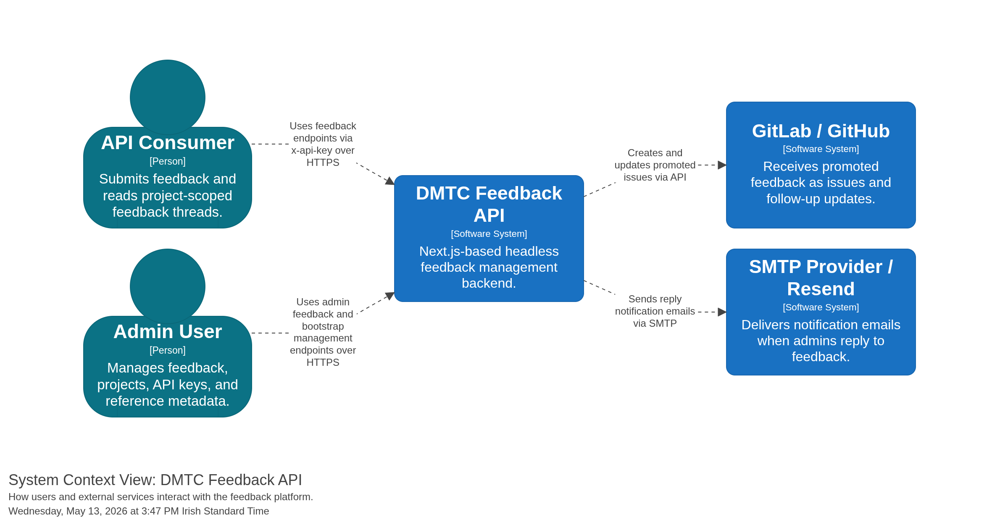

# Getting Started

## Overview

- Versioned REST API under `/api/v1/*`
- Project-scoped API keys via `x-api-key`
- Bootstrap-token protected admin key and project management
- Feedback thread support with initial and follow-up messages
- Email notifications for submissions and replies via SMTP or Resend
- Promotion sync to GitLab issues and/or GitHub issues
- OpenAPI JSON and Swagger UI docs
- SQLite-backed storage with hashed API keys

## Architecture



Additional generated diagrams are available in [`diagrams/`](../diagrams), including the system context and Docker deployment views.

## Local Development

```bash
npm ci
npm run migrate:up-seed
npm run dev
```

The migration command runs tracked SQLite migrations and records them in `schema_migrations`. Existing databases are adopted into the baseline migration automatically the first time they run the new migrator. See [migrations.md](./migrations.md) for details.

Run checks locally:

```bash
npm test -- --runInBand
npm run lint
```

If you hit stale `.next` issues:

```bash
pkill -f "next dev" || true
npm run clean
npm run dev
```

## Next Steps

- [Configuration](./configuration.md) — environment variables
- [Authentication](./authentication.md) — how `x-bootstrap-token` and `x-api-key` work
- [Bootstrap](./bootstrap.md) — create your first project and API keys
- [API Reference](./api.md) — routes, thread model, and request examples
